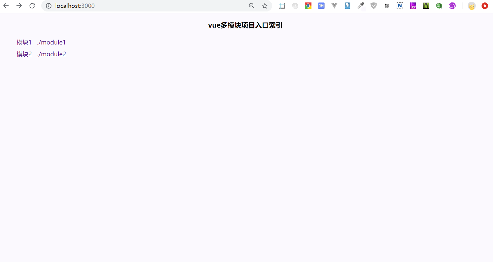

## 简介
vuejs 多模块项目搭建 
项目基于webpack 4.0构建 
具有同时打包多个模块的能力 


# 项目截图
    

## 前序准备
你需要在本地安装 [node](http://nodejs.org/) 和 [git](https://git-scm.com/)。本项目技术栈基于 [ES2015+](http://es6.ruanyifeng.com/)、[vue](https://cn.vuejs.org/index.html)、[vuex](https://vuex.vuejs.org/zh-cn/)、[vue-router](https://router.vuejs.org/zh-cn/) 、[axios](https://github.com/axios/axios) 和 [element-ui](https://github.com/ElemeFE/element)，所有的请求数据都使用[Mock.js](https://github.com/nuysoft/Mock)模拟，提前了解和学习这些知识会对使用本项目有很大的帮助。

## 开发
```bash
# 克隆项目
git clone https://github.com/chengxg/vue-multiple-module.git

# 安装依赖
npm install

# 建议不要用 cnpm 安装 会有各种诡异的bug 可以通过如下操作解决 npm 下载速度慢的问题
npm install --registry=https://registry.npm.taobao.org

# 启动服务
npm run dev
```

浏览器访问 http://localhost:3000

## 发布

```bash

# 构建生产环境
npm run build
```

